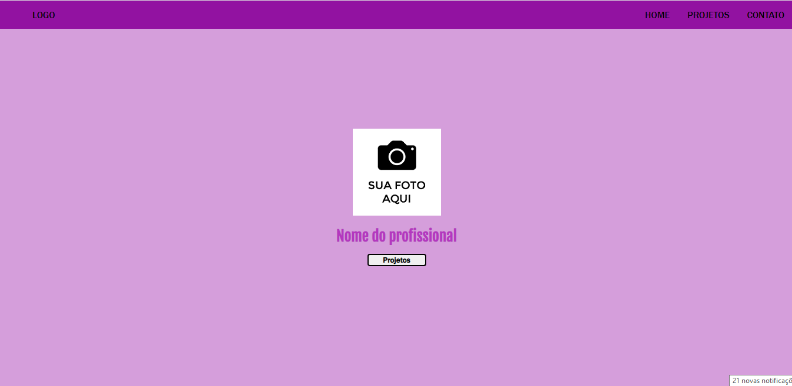
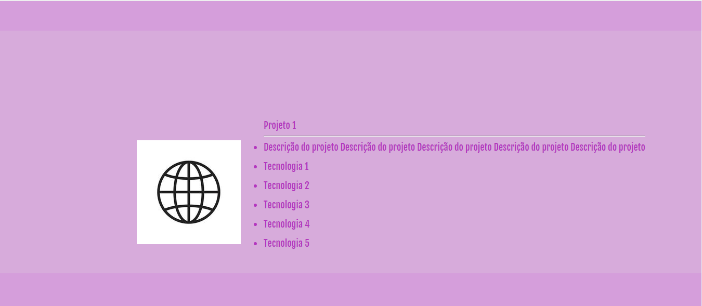
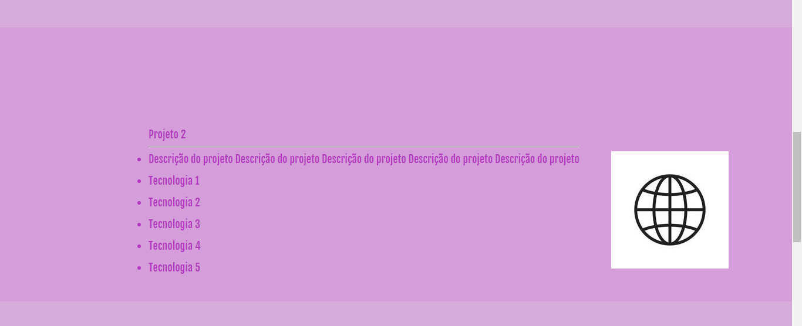
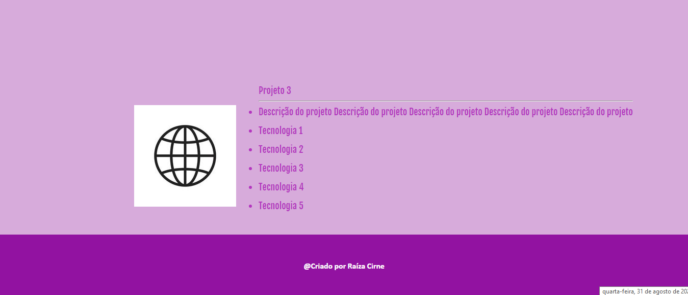

# 📋 Indíce

- [Bem-vindo](#id01)
- [Proposta](#id01)
  - [O desafio](#id01.1)
- [Screenshots](#id02)
- [Links](#id03)
- [Tecnologias utilizadas](#id04)
- [Pré-requisitos](#id05)
- [Procedimentos de instalação](#id06)
- [Autora](#id07)

# Bem-vindo! 👋 <a name="id01"></a>

**A construção deste projeto consiste em um modelo de portfólio.**

Essa foi a criação de um modelo de portfólio para desenvolvedores, afim de adquirir habilidades de codificação criando projetos realistas.

# 🚀 Proposta <a name="id01"></a>

Desafio da mentoria CSV para prática de projetos 

Escolha de um projeto com o prazo de entrega.

<br />

Data inicial: 02/08/2022

Data final: 07/08/2022

<br />

## :trophy: O desafio <a name="id01.1"></a>

<br />

O objetivo foi criar um modelo de portófio útil para utilização na comunidade de desenvolvedores e obter conhecimentos nas linguagens de marcação HTML5 e CSS3. 

Dentro da pasta `/design` encontram-se os designs do projeto. 
Os desenhos estão em formato PNG estático. Usei meu julgamento para estilos como `font-size`, `padding`, `margin` e `color`.

**A construção deste projeto consistiu em:**

1. Criação do arquivo `index.html` e do `style.css`. 

2. Um `header` com uma lista para navegação. 

3. Uma `div` principal para inserção de uma foto profissional com um `button` de projetos com link `href` direcionando para as `section` dos projetos no site.  

4. As `section` dos sites foram organizadas por `table`, `tr`, `td` e uma lista `ul` desordenada `li`    

5. Criação do `footer` 


# Tecnologias utilizadas <a name="#id04"></a>

- HTML5
- CSS3. 

<br />

# :camera_flash: Screenshots <a name="id02"></a>

<br />

## :desktop_computer: Desktop design



## Desktop design section 2



## Desktop design section 3



## Desktop design section 4



<br />

# :heavy_check_mark: Links <a name="id03"></a>

<br />

- Clique no link para acessar a página:

<br />

# 🛠 Tecnologias utilizadas <a name="id04"></a>

<br />

- HTML5
- CSS3

<br />

# ☑️ Pré-requisitos <a name="id05"></a>

<br />

- [x] Editor de código de sua preferência (recomendado VS code)
- [x] Git

<br />

# 📝 Procedimentos de instalação <a name="id06"></a>

<br />

Clone este repositório usando o comando:

```bash
git clone https://github.com/RaizaCirne/projeto-portfolio.git
```

<br />

**HTML - CSS** 🚀

# :sunglasses: Autora <a name="id07"></a>

<br />

- Personal Page - [Raíza Cirne Braz]()
- Frontend Mentor - [@RaizaCirne](https://www.frontendmentor.io/profile/RaizaCirne)
- GitHub - [RaizaCirne](https://github.com/RaizaCirne)
